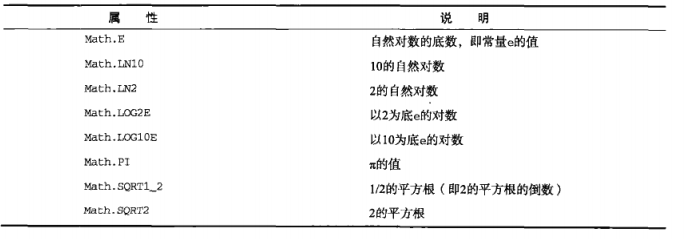

# Learn JavaScript

## 8 单体内置对象

ECMA-262 规定了内置对象："由ECMAScript提供，不依赖宿主环境的对象，在ECMAScript 程序执行前就已经存在了"
内置对象：Object、Array和String....
单体内置对象：Global 和 Math

### 8.1 Global 对象

不属于任何其他对象的属性和方法，都是Global对象的属性和方法；所有在全局作用域中定义的属性和函数，都是Global对象的属性，但是不管是以什么角度去看，Global对象都是不存在的，但是通过window对象就可以使用Global对象的属性和方法

#### 8.1.1 Global 对象的一些方法

1. URI 编码方法

    encodeURI() || encodeURIComponent() || decodeURI() || decodeURIComponent()

    用于对URI进行编码，以便发送给浏览器，有效的URI不能包含某些字符；
    通过UTF-8 编码替换掉无效的字符，从而让浏览器能够接收和理解；

    encodeURI -- 主要应用于整个URI 不会对于URI本身的特殊字符进行编译，只有空格被替换成%20；
    encodeURIComponent -- 主要应用于URI的片段 对于整个URI的特殊字符进行编译
    decodeURI -- 进行encodeURI 相反的操作
    decodeURIComponent -- 进行encodeURIComponent 相反的操作

        ```js
            var u = 'https://www.lagou.com/resume/my resume.html'
            console.log(encodeURI(u)); // https://www.lagou.com/resume/my%20resume.html
            console.log(encodeURIComponent(u)); // https%3A%2F%2Fwww.lagou.com%2Fresume%2Fmy%20resume.html
        ```

    由于一般用于对查询字符串进行编译，所以常使用 `encodeURIComponent`

    - 注：
        1. URI是一个用于标识某一互联网资源名称的字符串。 该种标识允许用户对任何（包括本地和互联网）的资源通过特定的协议进行交互操作。URI由包括确定语法和相关协议的方案所定义。格式： "协议://域名/目录a/文件D"；
        2. URI方法能够编译所有 Unicode 的字符；

2. eval()

    会将eval传入的字符串当做实际的ECMAScript语句来解析，然后将执行结果插入的原位置；

    - 注：
        1. eval 转的变量或者函数，不会存在变量提升
        2. eval 十分危险，使用时要注意被注入代码

3. Global 对象的属性

    

4. window 对象

    ECMAScript 中没有指出如何直接访问Global对象，但是提供了window对象，而Global就作为window对象的一部分实现；所以Global的所有属性都可以在window中找到；

### 8.2 Math 对象

[DOME2](./html/dome2.js)

#### 8.2.1 Math 对象的属性



#### 8.2.2 Math 对象的方法

1. min() 与 max()

        ```js
        Math.min(number, number ....):number
        Math.max(number, number ....):number
        ```

        ```js
        var mi = Math.min(1,2,1,3,21,32);
        console.log(mi); // 1
        var mx = Math.max(1,2,1,23,123,12);
        console.log(mx); // 123
        ```

    可以通过apply的方法，找到数组的最大或者最小值；

        ```js
            var arr = [1,22,1,22,33,12]
            var mi2 = Math.min.apply(Math,arr)
            var mi3 = Math.max.apply(Math,arr)
            console.log(mi2); // 1
            console.log(mi3); // 33
        ```

2. 舍入方法

    Math.ceil() || Math.floor() || Math.round()

    Math.ceil() --- 向上取整
    Math.floor() --- 向下取整
    Math.round() --- 四舍五入

3. 随机

    Math.random()

    实例： 去任意区间内的随机数

        ```js
            function limitRandom (min, max){
                var l = max - min + 1;
                return Math.floor(Math.random() * l + min);
            }

            var num = limitRandom(10, 20)
            console.log(num);
        ```

    - 注: l --- 区间内的可以的值的总数；

    实例： 与数组配合，随机取出数组中的某一项

        ```js
            var color = ['red','black','yellow','blue'];
            function arrRandom (arr) {
                return arr[limitRandom(0, arr.length-1)]
            }
            var colorR = arrRandom(color)
            console.log(colorR);
        ```

4. 其他方法


这些都是常有方法；
